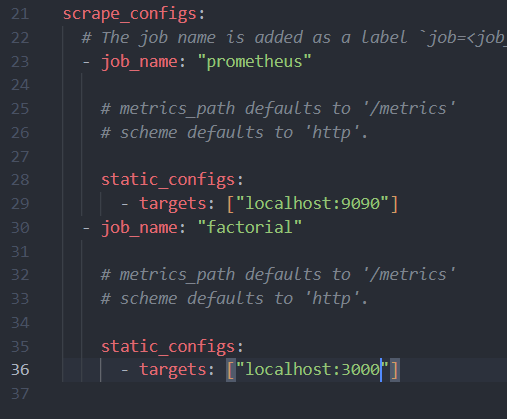
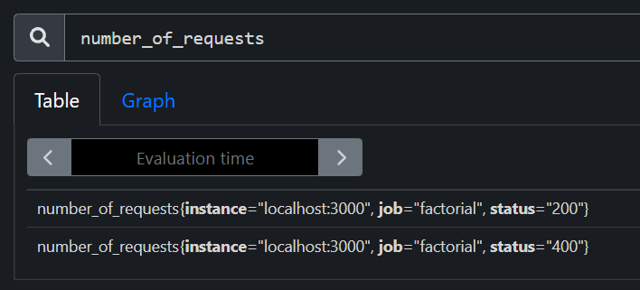
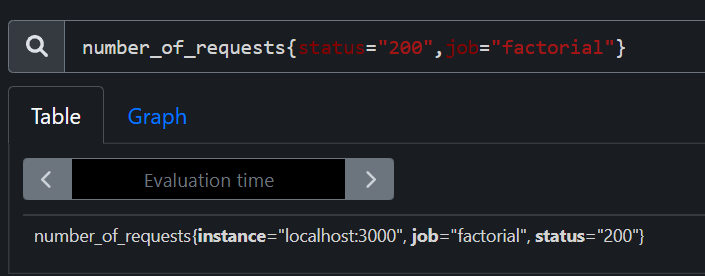
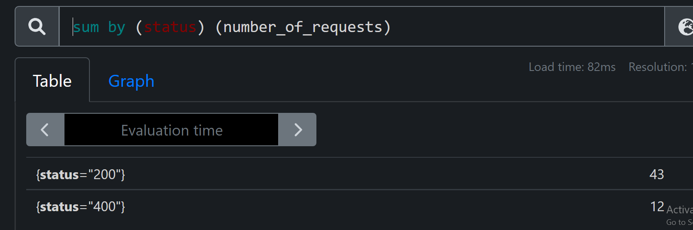
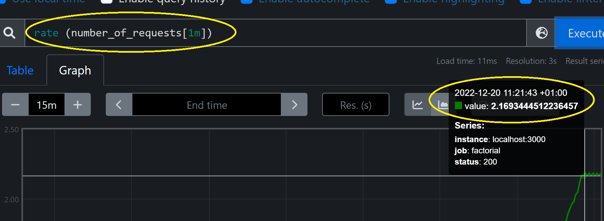
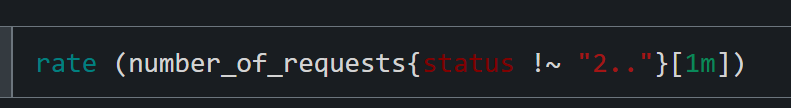
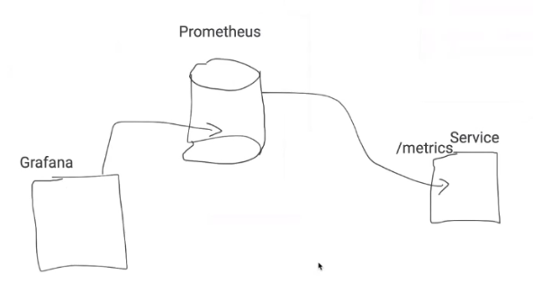
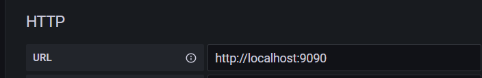
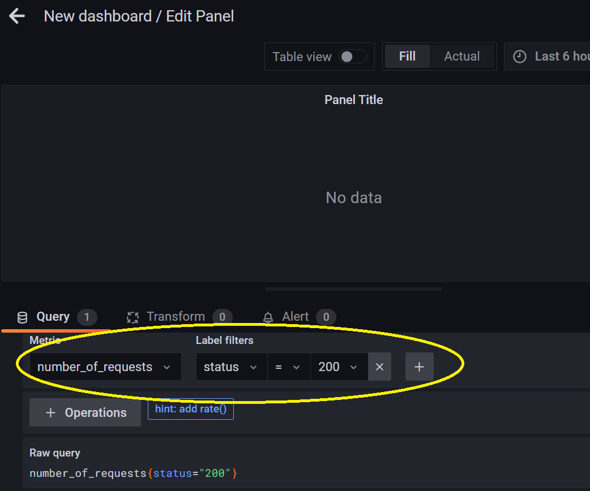
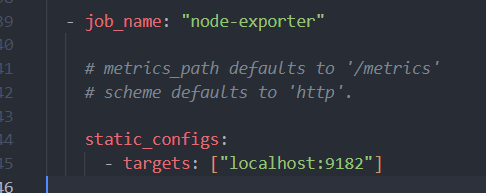

# Metrics

Types of metrics :

<li>Counters: metrics that their values are always increasing or always decreasing (e.g. total number of http requests </li> 
<li>Gauges: Something that always varies (e.g. free memory)</li>
<li>Histograms</li>

# Prometheus

Prometheus is a free software application used for event monitoring and alerting. It records real-time metrics in a time series database.

#### Download prometheus client

`npm i prom-client`  

#### How to get data gererated by Prometheus?  

There are two ways: 

<ol>  
    <li>Our main app send data periodically to Prometheus DB.</li>
   <li>Our Prometheus database gets the data from the app via /metrics endpoint.</li>
</ol>
       
We generally use the second way.
Using the first, our app becomes dependent on the Prometheus server, it should know how to communicate with it. If we change the Prometheus database  we should update our app.
However, this method is useful when we’re using lambda function for example.
Our app isn’t always available (serverless) so it should communicate with the DB since we can’t expose /metrics that’s always available.

#### Download and launch prometheus DB

   <ul>
    <li><a href="https://prometheus.io/download/">Download page</a>  </li>
    <li>cd to the prometheus folder then Execute prometheus.exe</li>
    <li><a href="http://localhost:9090/">http://localhost:9090/</a>  </li>
    </ul>

#### Add a target to prometheus

There are two ways to add targets to perothemeus: static definition (define a target statically) and dynamic definition(automatic discovery in k8s for e.g.).

<ul>
    <li>Add a new job under scrape_configs: in the <b>prometheus.yml</b> file 
    
    </li>
    <li>Go to <a href="http://localhost:9090/targets"> http://localhost:9090/targets </a> to verify that our atarget is added</li>
</ul>

#### Queries: PromQL (Prometheus Query Language)

<ul>
    <li>  
   
    </li>
    <li>  
   
    </li>
    <li>  
   
    </li>
    <li>Rate: Average number of requests in the last 1 min    
   
    </li>
    </li>
    <li>Rate of unsuccessfull requests    
   
    </li>

</ul>

# Grafana

 
 

#### Set up

<ul>
<li> <a href="https://grafana.com/get/?plcmt=top-nav&cta=downloads&tab=self-managed">Download grafana</a></li>
<li> Execute the file grafana-server => it uses port 3000</li>
<li> <a href="http://localhost:3000">http://localhost:3000 </a> Use admin for the password and username</li>
<li>  
Add to new data srouce     
 
</li>
<li>  
Create a new data source (add a new panel with prometheus as the data source)     
 
</li>

</ul>

#### Notes

Two types of metrics

<ul>
<li>Application level metrics </li>
<li>Host level  metrics (RAM, cpu,..) </li>
</ul>

# Node Exporter (collect host metrics)

<ul>

<li> Download node exporter (windows exporter for windows os):
<a href="https://github.com/prometheus-community/windows_exporter/releases"> Download page</a></li> 

<li> Execute the binary file</li>
<li> 
Go to <a href="http://localhost:9182/metrics"> http://localhost:9182/metrics</a>
(The port may be different in linux)
</li>
<li>
Add a job in prometheus.yml  
 

   </li>
<li>Verify that a new target is added at  <a href="http://localhost:9090/targets">http://localhost:9090/targets</a></li>
<li>Get a node exporter dashboard (or windows explorer) from  
<a href="https://grafana.com/grafana/dashboards/14694-windows-exporter-dashboard/">grafana dashboards</a> => Copy its id
   
   </li>
<li>Import the dashboard in grafana (using the id copied grafana dashboards)  </li>
</ul>
